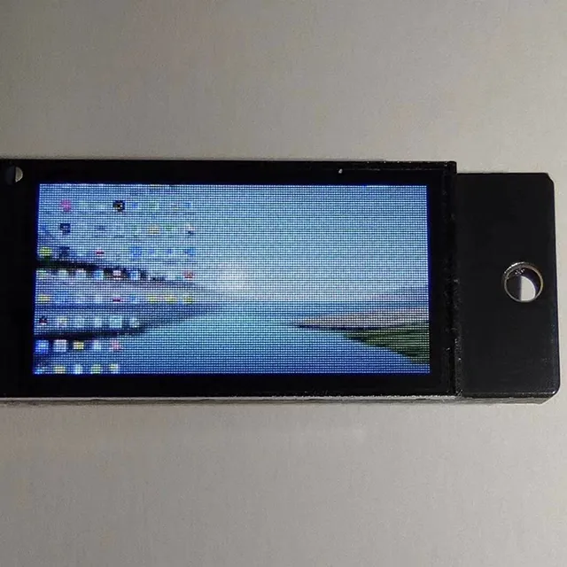
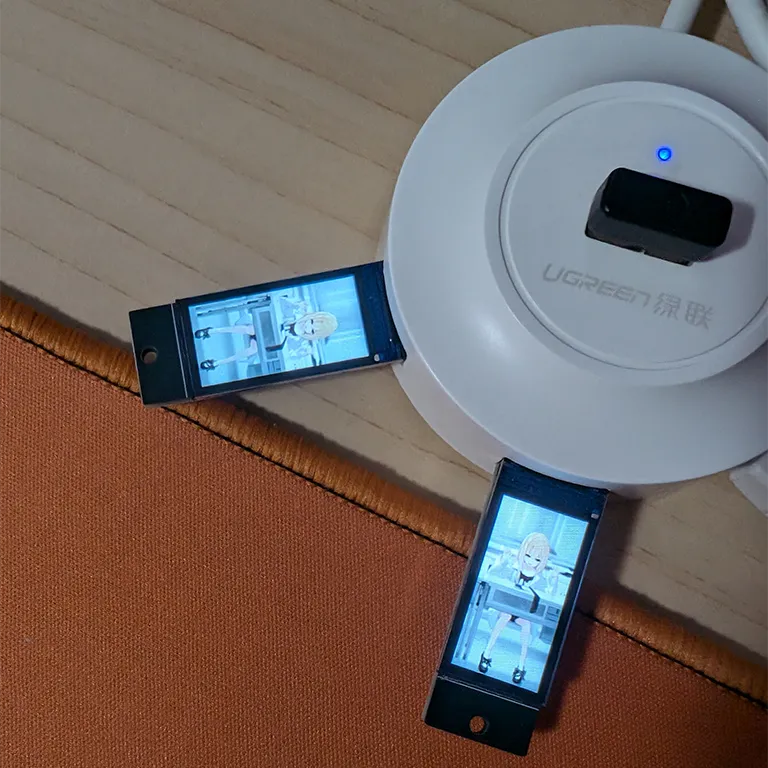

# USB小屏幕！

大家有买过10块钱的显示器吗？

我前2天在淘宝上发现了1个10块钱的USB显示器，是[这个](https://item.taobao.com/item.htm?id=841679900812)。



这个东西是很好，但它协议上不是1个显示器，而是1个USB转串口的设备，所以需要用卖家给的1个Python代码才能显示。

然后我需要显示1些自定义的东西，就想改1改他们的代码，才发现他们的代码实在是太烂！那个代码只要看上1分钟，人就会怒火中烧！

所以我就重写了1遍，做成1个好1点的SDK，这样大家买这个东西回去用就不会生气了！


## 安装

你只需要1个Python，然后:

```sh
pip install git+https://github.com/RimoChan/rimo_mini_screen.git
```

就可以了！


## 使用方法

接口有2个，是这样——

```python
def get_mini_screen_device() -> list[MiniScreen]
```

这样来获取所有插在电脑上的小屏幕对象。

```python
MiniScreen.show(self, img: PIL.Image.Image):
```

这样在其中1个屏幕上显示你的图片。

```python
MiniScreen.touch: int
```

这是一个属性，用来查询小屏幕上的按键是否被按下。对，这个10块钱的屏幕上居然有1个触摸按键，虽然1般不会去按它……差不多数值低于3600就是按下状态了。

举个例子，比如我有1张我的照片，可以这样把它显示到小屏幕上:

```python
import time
import PIL.Image
from rimo_mini_screen import get_mini_screen_device

if __name__ == '__main__':
    a = get_mini_screen_device()
    if not a:
        print('找不到屏幕！')
        exit()
    img = PIL.Image.open('h.webp')
    while True:
        for screen in a:
            screen.show(img)
        time.sleep(0.01)
```

显示出来效果是这样: <sub>(我还买了2个！)</sub>



顺便说1下上面那个卖家秀里面，它是怎样显示桌面的，其实就是用`pyautogui.screenshot()`不停地给桌面截图。所以你把`screen.show`的参数的图片换成这个，就可以投屏桌面了！


## 结束

就这样，大家88，我要去泄1泄火了！
